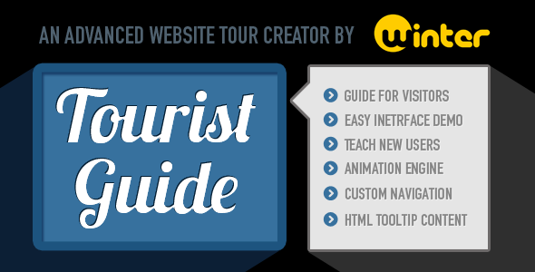
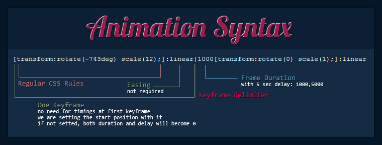

# Warning

This repository is not maintained, it is only here for historical reasons. It was originally sold on CodeCanyon.

# touristguide - jQuery Plugin - 2012

Demo: [https://wintercounter.github.io/touristguide](https://wintercounter.github.io/touristguide)

<h3>Description</h3>
This <strong>jQuery Plugin</strong> is a handy tool tour create website tours for your visitors. It&#8217;s the <strong>perfect tool</strong> to gain attraction and reach more time spent on your website. Usefull for <strong>introduce your site</strong> for new visitors, to indroduce the new design of your site or to help users to learn the usage of your site. The plugin is cross-browser compatible and works <strong>out of the box</strong>, it&#8217;s horribly easy to use and <strong>customize</strong> and has  <strong>advanced animation engine</strong>. Users hardly accept old sites with new design as they feel uncomfortable. The plugin will help you to solve this!

<h3>Features</h3>
<ul>
<li>Ease Of Use</li>
<li>Any kind of HTML Tooltip Content</li>
<li>Keyframe based CSS3 Animation Engine</li>
<li>One-by-one Tooltip Customization using DATA Tags</li>
<li>AutoPlay Feature</li>
<li>Optional Prompt because of accidental closing.</li>
<li>Highly Customizable</li>
<li>Multiple Callbacks</li>
<li>Multiple built-in methods</li>
<li>Support for different styles</li>
</ul>